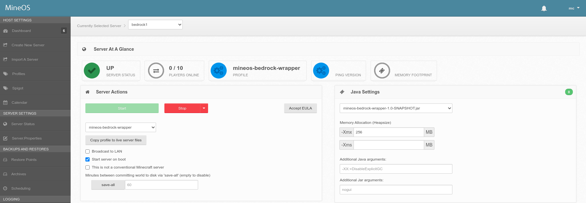
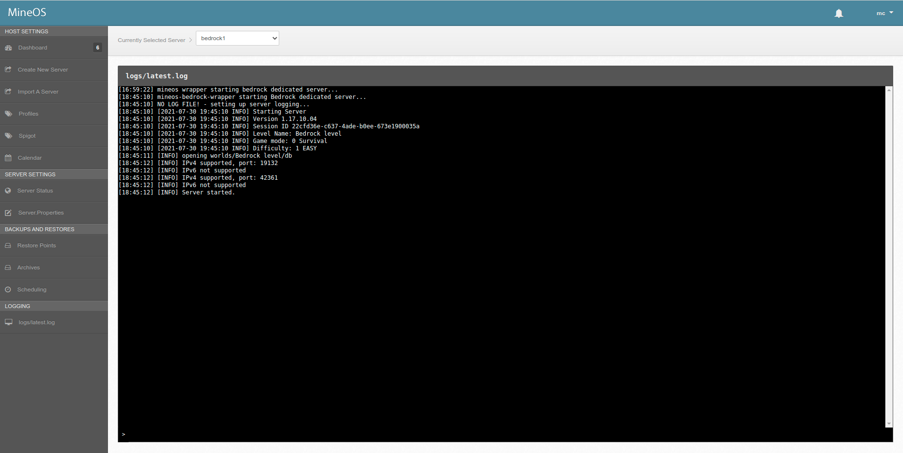

# MineOS Bedrock Wrapper
A Java jar wrapper for the official Minecraft Linux Bedrock Server 

https://www.minecraft.net/en-us/download/server/bedrock

Consult the README in mineos-node_patch/ to correctly add this functionality to mineos-node whilst not in the official MineOS-node release.

Usage
-----

In the MineOS UI
1. Download the Mineosbedrockwrapper profile
2. Create a new server (E.G. bedrock1) and set the profile to Mineosbedrockwrapper.  Note: -Xmx and -Xms are ignored. The default is OK.
3. Set the service to start on boot, edit the Server.properties, etc.
4. Select button Copy profile to live server files
5. Set the runnable jar to mineos-bedrock-wrapper-1.0-SNAPSHOT.jar

At the CLI
6. cd to the hosted server directory (E.G. /var/games/minecraft/servers/bedrock1)
7. Download the official Linux Bedrock Server from https://www.minecraft.net/en-us/download/server/bedrock
8. unzip the bedrock server software. The server itself will be at (E.G) /var/games/minecraft/servers/bedrock1/bedrock_server
9. chmod +x the bedrock_server software. Ensure all other permissons are appropriate.

In the MineOS UI
10. Start the server

Play Bedrock. Enjoy.

Start and Stop servers as per usual

Full logging output with interactive CLI

